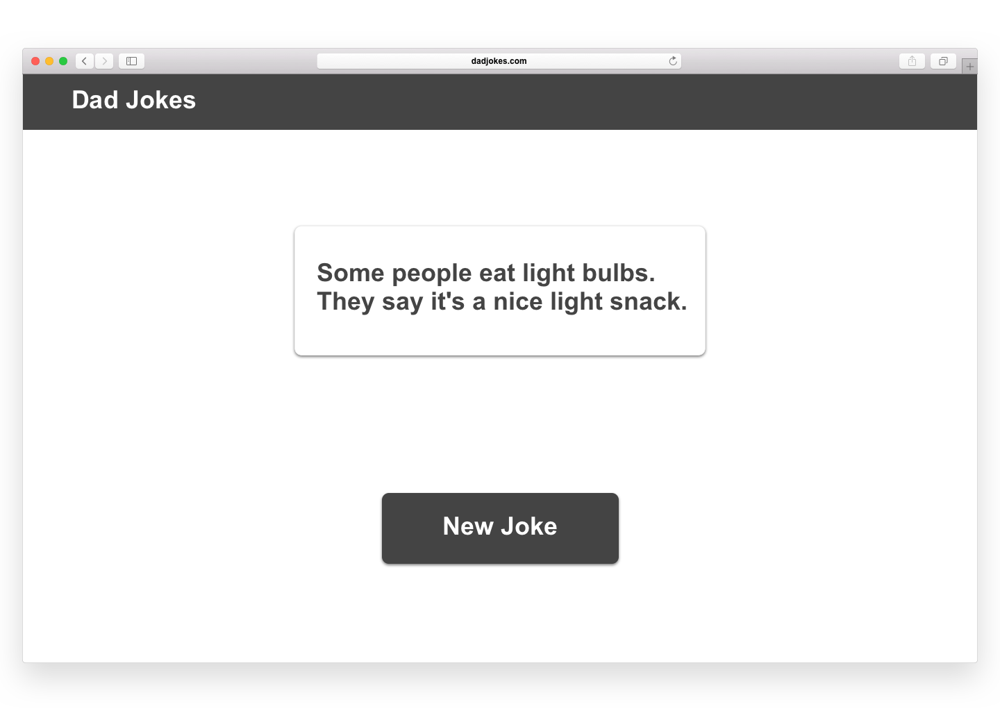

# Dad Jokes

The [Dad Jokes API](https://icanhazdadjoke.com/api) includes an endpoint for
[getting a random dad joke](https://icanhazdadjoke.com/api#fetch-a-random-dad-joke).
Your task is to build an app using React that displays a random dad joke from
the API with the push of a button!

## Prerequisites

- React and React Components
- State and Props
- The Component Lifecycle Methods
- Working with an API

## Instructions

1.  Fork and clone this repository.
1.  Change into the new directory.
1.  Install dependencies.
1.  Fulfill the listed requirements.
1.  Make a pull request to submit your work.

The starter code provided here is based on Create React App. Make a pull request
by the end of the lab block for your assignment to be considered complete.

## Requirements

Your application should make a random dad joke appear when the app loads.

It should also display a large button that, when clicked, fetches a random dad
joke from the dad jokes API and displays it to the user. Make it look as close
to the image provided below.

## Bonus

Build a queue that stores the 10 most recently retrieved dad jokes!
Additionally, add some buttons that let you scroll back and forth through the
queue.

You should have:

- One button to get a new joke (append to queue). If there are >10 jokes in the
  queue, drop the oldest one.
- One button to advance to the next joke.
- One button to move to the previous joke.

## [License](LICENSE)

1.  All content is licensed under a CC­BY­NC­SA 4.0 license.
1.  All software code is licensed under GNU GPLv3. For commercial use or
    alternative licensing, please contact legal@ga.co.
